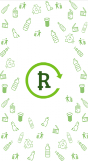
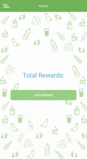

| Stable |
|-------|
|  |

# recoin-network
ReCoin (RYC) provides a cryptocurrency incentive to recycle.

 &nbsp;&nbsp;&nbsp; 

## Training 

- 10,000/1,000 Training/Validation set using images from ImageNet. 
- 32 epochs

## Download
Get the app from the [releases page](https://github.com/zero-delta/recoin-network/releases).

Also avaialbe on the [Play Store](https://play.google.com/store/apps/details?id=network.recoin.rewardapp&hl=en_US).
